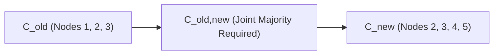

# Raft Joint Consensus Membership Reconfiguration Skill

High-efficiency, zero-dependency Python implementation of **Raft Joint Consensus** for zero-downtime cluster membership changes.

## Features
- **Split-Brain Immunity**: Enforces simultaneous majorities from both \(C_{	ext{old}}\) and \(C_{	ext{new}}\) during transitional configuration phases.
- **Two-Phase Reconfiguration**: Gracefully expands or contracts cluster topologies without downtime.
- **Zero External Dependencies**: Pure Python standard library.
- **Native MCP Protocol**: JSON-RPC 2.0 stdio server compatible with Claude Desktop, Cursor, and Windsurf.

## Architecture

